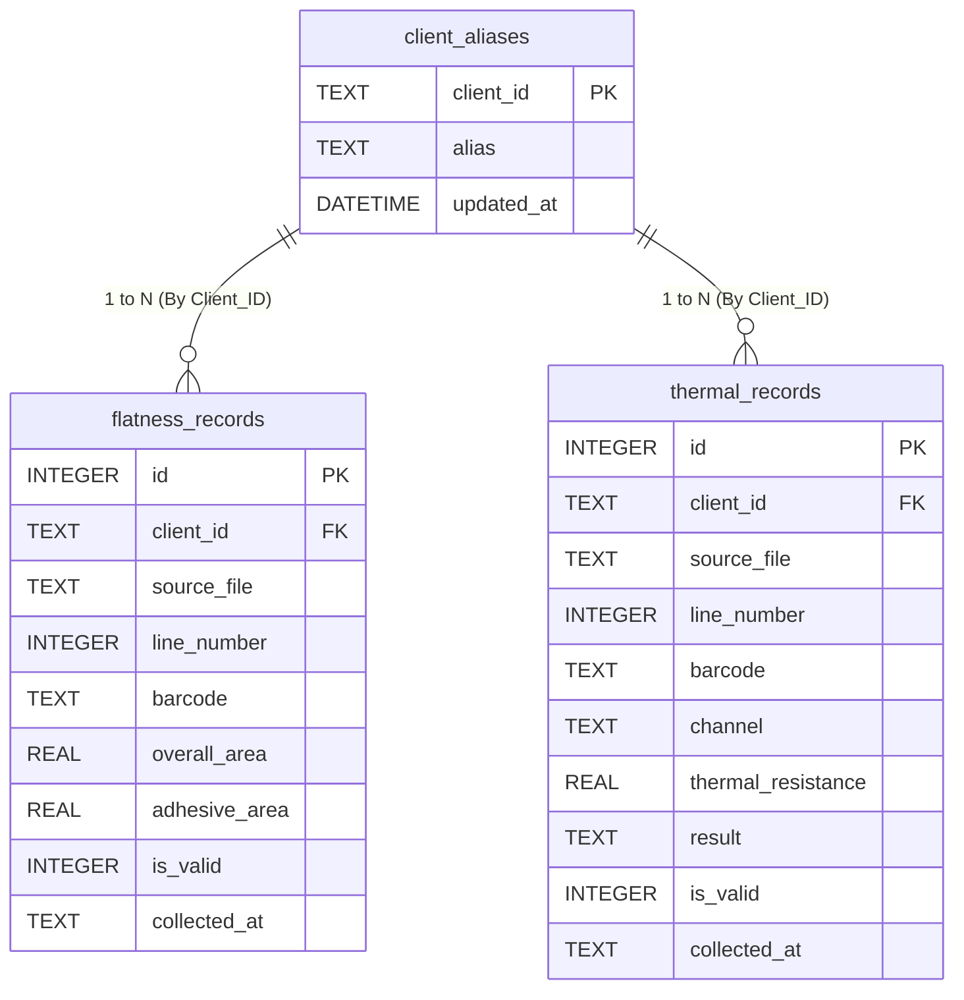

# 数据库与数据流分析 (Database & Dataflow)

## 1. 文档目的
阐明项目核心的数据持久化模型（表结构关系）、使用机制，并以图例的方式理清业务数据从发生采集到落实在报表上的数据流全景。

## 2. 数据库设计总览
* **介质**: SQLite (单文件保存)
* **位置**: `data/sync_server.db`
* **性能模式**: 启用了 `WAL (Write-Ahead-Log)` 模式，此模式允许极其强大的读并发与相对出色的写并发。

项目包含 3 张核心实体表，其中平坦度和热阻是两套几乎隔离平行不相交的生产序列测试数据。

### 2.1 核心表定义

#### `flatness_records` (平坦度设备上报记录)
* **业务主体**: 存放来自设备对芯片/板件的平面物理属性进行的扫测合格度分析。
* **关键字段**: 
  * `client_id` (文本, 客户端标称)
  * `barcode` (文本, 产品流转唯一 SN 条码)
  * `overall_area` & `adhesive_area` (浮点, 测试计算出的数值面)
  * `is_valid` (标志位，是否是符合质量清洗的有效记录)
* **主键规则**: 自增 `id` (主键); 并在业务上由 `UNIQUE(client_id, source_file, line_number)` 作为唯一复合约束。

#### `thermal_records` (热阻设备上报记录)
* **业务主体**: 存放来自机台对散件施加热压等进行的热传导效率记录。
* **关键字段**:
  * `client_id` (文本，客机标称)
  * `barcode` (文本，芯片/模组对应 SN 条码)
  * `chip_temp`, `temp_diff`, `thermal_resistance` (浮点环境与结温度等)
  * `result` (文本，`PASS` 表合格)
* **主键规则**: 同上 `UNIQUE(client_id, source_file, line_number)`。

#### `client_aliases` (终端设备别名字典表)
* **业务主体**: 为干冷的工控机 `MAC地址` 提供可视化运营标签映射。
* **关联关系**: 此表的 `client_id` 以 1 对多隐性关联了以上两张记录表的 `client_id`。

---

## 3. ER 数据关系图



---

## 4. 核心数据流路径 (Dataflow)

```mermaid
flowchart TD
    %% 角色定义
    subgraph Edge[边缘侧 (生产测试工控机)]
        C_PT[平坦度客户端\npt-sync]
        C_RZ[热阻客户端\nrz-sync]
    end

    subgraph Server[数据同步网关 (Node.js)]
        API_UL_PT[POST /upload/flatness]
        API_UL_RZ[POST /upload/thermal]
        API_RECORDS[GET /records/*\nGET /stats]
        API_UI[GET / (Web 报表)]
    end

    subgraph DB[SQLite 持久化引擎]
        TBL_PT[(flatness_records\n表业务并发写入)]
        TBL_RZ[(thermal_records\n表业务并发写入)]
        TBL_ALIAS[(client_aliases)]
    end

    subgraph Users[数据消费方]
        Q_User[驻场工艺员 / 测试人员]
        EXT_SYS[MES 其他统计系统 API]
    end

    %% 数据流动路径
    C_PT --"解析本地 CSV 并组装批量 JSON 发送"--> API_UL_PT
    C_RZ --"解析本地 CSV 并组装批量 JSON 发送"--> API_UL_RZ

    API_UL_PT --"插入多条记录事务\n触发 UNIQUE(机号/文件/行) 报错并忽略重复"--> TBL_PT
    API_UL_RZ --"插入多条记录事务\n触发 UNIQUE(机号/文件/行) 报错并忽略重复"--> TBL_RZ

    TBL_PT -. "汇聚读取与关联" .-> API_RECORDS
    TBL_RZ -. "汇聚读取与关联" .-> API_RECORDS
    TBL_ALIAS -. "联表提取别名备注" .-> API_RECORDS
    
    API_RECORDS --> API_UI
    
    API_UI --"Web 直观分析"--> Q_User
    API_RECORDS --"拉取 JSON 序列化数据二次处理"--> EXT_SYS

```

### 数据流特征说明
1. **上游推式汇集 (Push Mode)**：数据是由客户端定时或者事件触发式，将 CSV 中的数据列读取解析后推流给服务端的。
2. **幂等存储拦截墙**：由于边缘系统常常受极差网络及设备断电影响，Server 直接利用底层 SQLite 的 `IGNORE` 抛弃逻辑消化冗余上传报文。
3. **隔离池化**：两套数据的列名相差极大约有 10+ 字段。完全将平坦度和热阻存放两池避免产生稀疏宽表问题，利于单独针对查询索引优化。

---
*生成时间: 2026-03*
*信息来源: 路由源码文件 `server.js` 和表结构设计 `db.js`*
