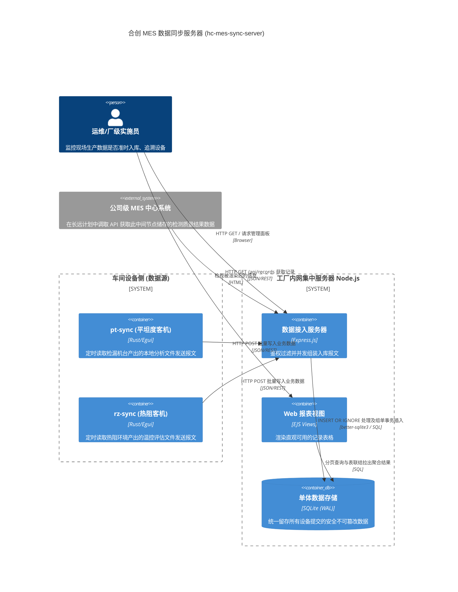

# 整体架构图 (Architecture Diagrams)

## 系统 C4 容器模型架构

```mermaid
C4Container
    title 合创 MES 数据同步服务器 (hc-mes-sync-server)

    Person(admin, "运维/厂级实施员", "监控现场生产数据是否准时入库、追溯设备")

    System_Boundary(Edge, "车间设备侧 (数据源)") {
        Container(pt_client, "pt-sync (平坦度客机)", "Rust/Egui", "定时读取检漏机台产出的本地分析文件发送报文")
        Container(rz_client, "rz-sync (热阻客机)", "Rust/Egui", "定时读取热阻环境产出的温控评估文件发送报文")
    }

    System_Boundary(ServerOS, "工厂内网集中服务器 Node.js") {
        Container(server, "数据接入服务器", "Express.js", "鉴权过滤并并发组装入库报文")
        Container(ui, "Web 报表视图", "EJS Views", "渲染直观可用的记录表格")
        
        ContainerDb(sqlite, "单体数据存储", "SQLite (WAL)", "统一留存所有设备提交的安全不可篡改数据")
    }
    
    System_Ext(mes_core, "公司级 MES 中心系统", "在长远计划中调取 API 获取此中间节点储存的检测质量结果数据")

    Rel(pt_client, server, "HTTP POST 批量写入业务数据", "JSON/REST")
    Rel(rz_client, server, "HTTP POST 批量写入业务数据", "JSON/REST")
    Rel(admin, server, "HTTP GET / 请求管理面板", "Browser")
    Rel(admin, ui, "检视被渲染后的信息", "HTML")
    
    Rel(server, sqlite, "INSERT OR IGNORE 处理及组单事务插入", "better-sqlite3 / SQL")
    Rel(ui, sqlite, "分页查询与表联结拉出聚合结果", "SQL")
    Rel(mes_core, server, "HTTP GET /api/records 获取记录", "JSON/REST")

```

---
*设计解读*:
以上完整演示了系统处于整个工厂网络中的枢纽地带，接手杂乱小设备文件化数据并归整的核心任务。
