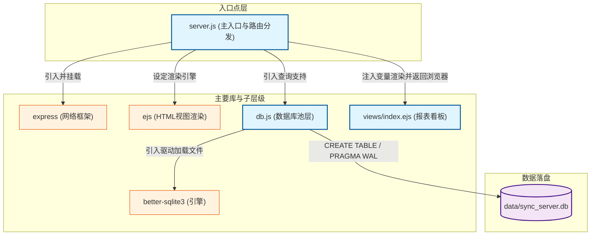

# 模块依赖图 (Module Dependencies)

由于该后端的模块架构极少，高度耦合，其主要的模块和组件引用关系如下：

```mermaid
graph TD
    classDef main fill:#e1f5fe,stroke:#01579b,stroke-width:2px;
    classDef dep fill:#fff3e0,stroke:#e65100,stroke-width:1px;
    classDef data fill:#f3e5f5,stroke:#4a148c,stroke-width:2px;
    
    subgraph 入口点层
        ServerJS["server.js (主入口与路由分发)"]:::main
    end

    subgraph 主要库与子层级
        Express["express (网络框架)"]:::dep
        EJS["ejs (HTML视图渲染)"]:::dep
        DBJS["db.js (数据库池层)"]:::main
        BetterSQLite["better-sqlite3 (引擎)"]:::dep
        Views["views/index.ejs (报表看板)"]:::main
    end

    subgraph 数据落盘
        SQLiteDB[("data/sync_server.db")]:::data
    end

    ServerJS -->|引入并挂载| Express
    ServerJS -->|设定渲染引擎| EJS
    ServerJS -->|引入查询支持| DBJS
    ServerJS -->|注入变量渲染并返回浏览器| Views

    DBJS -->|引入驱动加载文件| BetterSQLite
    DBJS -->|CREATE TABLE / PRAGMA WAL| SQLiteDB

```

---
*说明*: 
可以看出 `server.js` 并发地统领了表示层渲染（`views/index.ejs`）与数据层操作（`db.js`），处于上帝类的全控态势，这是一个最标准的传统 MVC 极简化形态。
