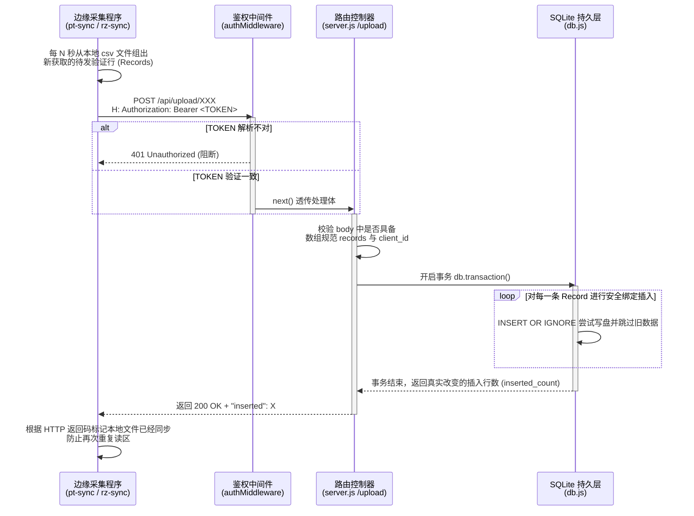
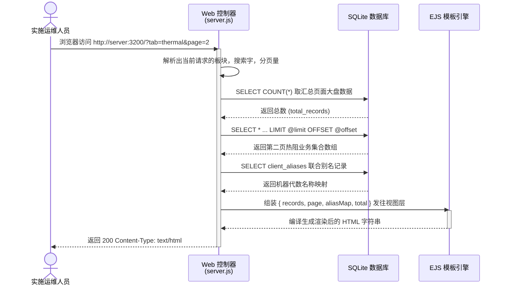

# 关键业务时序图 (Runtime Flow)

## 1. 核心上报数据入库链路时序 (Upload Flow)
这是系统中最重要也是发生频率最高的通信阶段——终端采集机将数据汇总之服务器。

```mermaid
sequenceDiagram
    participant Client as 边缘采集程序<br>(pt-sync / rz-sync)
    participant Auth as 鉴权中间件<br>(authMiddleware)
    participant Route as 路由控制器<br>(server.js /upload)
    participant DB as SQLite 持久层<br>(db.js)

    Client->>Client: 每 N 秒从本地 csv 文件组出<br>新获取的待发验证行 (Records)
    Client->>Auth: POST /api/upload/XXX <br> H: Authorization: Bearer <TOKEN>
    
    activate Auth
    alt TOKEN 解析不对
        Auth-->>Client: 401 Unauthorized (阻断)
    else TOKEN 验证一致
        Auth->>Route: next() 透传处理体
    end
    deactivate Auth
    
    activate Route
    Route->>Route: 校验 body 中是否具备<br> 数组规范 records 与 client_id
    Route->>DB: 开启事务 db.transaction()
    
    activate DB
    loop 对每一条 Record 进行安全绑定插入
        DB->>DB: INSERT OR IGNORE 尝试写盘并跳过旧数据
    end
    DB-->>Route: 事务结束，返回真实改变的插入行数 (inserted_count)
    deactivate DB
    
    Route-->>Client: 返回 200 OK + "inserted": X 
    deactivate Route

    Client->>Client: 根据 HTTP 返回码标记本地文件已经同步 <br> 防止再次重复读区
```

## 2. 网页看板直查流 (Dashboard Render Flow)

```mermaid
sequenceDiagram
    actor Admin as 实施运维人员
    participant Express as Web 控制器<br>(server.js)
    participant DB as SQLite 数据库
    participant EJS as EJS 模板引擎

    Admin->>Express: 浏览器访问 http://server:3200/?tab=thermal&page=2
    
    activate Express
    Express->>Express: 解析出当前请求的板块，搜索字，分页量
    Express->>DB: SELECT COUNT(*) 取汇总页面大盘数据
    DB-->>Express: 返回总数 (total_records)
    
    Express->>DB: SELECT * ... LIMIT @limit OFFSET @offset
    DB-->>Express: 返回第二页热阻业务集合数组 
    
    Express->>DB: SELECT client_aliases 联合别名记录
    DB-->>Express: 返回机器代数名称映射
    
    Express->>EJS: 组装 { records, page, aliasMap, total } 发往视图层
    activate EJS
    EJS-->>Express: 编译生成渲染后的 HTML 字符串
    deactivate EJS
    
    Express-->>Admin: 返回 200 Content-Type: text/html
    deactivate Express

```
